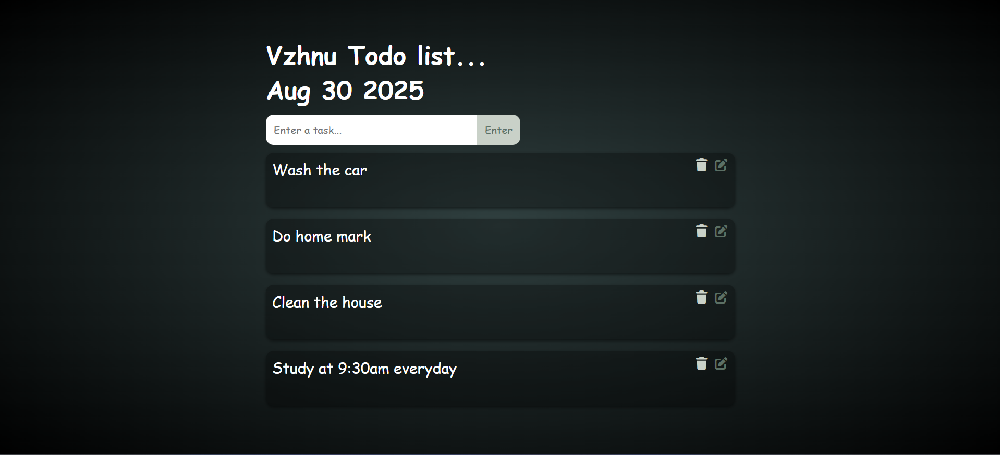

# 📝 To-Do List App

A simple and interactive To-Do List web application built using **HTML, CSS, and JavaScript**.  
This app allows users to add, edit, delete, and save tasks with data persistence using **LocalStorage**.

---

## 🚀 Live Demo
👉 [Click here to try the app](https://task-wallet.netlify.app/)  

*(Replace the above link with your GitHub Pages / Netlify / Vercel deployment link.)*

---

## 📸 Screenshot


---

## ✨ Features
- ✅ Add new tasks  
- 📝 Edit existing tasks  
- ❌ Delete tasks  
- 💾 Data persistence with LocalStorage  
- 📅 Displays current date dynamically  

---

## 🛠️ Technologies Used
- **HTML5**  
- **CSS3**  
- **JavaScript (Vanilla JS)**  
- **LocalStorage API**  

---

## ⚡ How to Run Locally
1. Clone this repository:
   ```bash
   git clone https://github.com/your-username/todo-list-app.git
   ```
2. Open the project folder:
   ```bash
   cd todo-list-app
   ```
3. Open `index.html` in your browser.

---

## 📂 Project Structure
```
.
├── index.html            # Main HTML file
├── index.js              # JavaScript logic
├── index.css             # Stylesheet
├── to-do_screesnhot.png  # Screenshot
└── README.md             # Project documentation
```

---

## 📌 Deployment
You can easily deploy this project using:
- **GitHub Pages** → Free & simple  
- **Netlify** → Drag & drop deployment  
- **Vercel** → Best for frontend hosting  

---

## 👨‍💻 Author
Developed by **Vishnukumar** 🚀  


